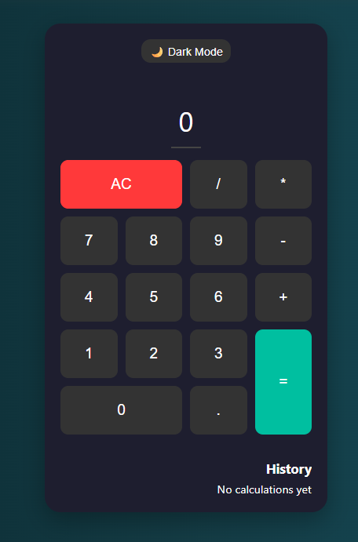

# 🧮 React Calculator

A sleek **React Calculator** built with **Vite** and styled with modern CSS.  
It supports real-time arithmetic operations, keyboard input, theme toggle, and keeps track of your calculation history.

 

---

## Live demo 🚀 
**[Calculator](https://calcutor-eight.vercel.app/)**

---

## 🌟 Features

✅ Perform basic arithmetic operations: addition, subtraction, multiplication, division.  
✅ **Keyboard support** – type numbers/operators directly.  
✅ **Dark / Light mode toggle** 🌙☀️ for better usability.  
✅ Displays **error messages** for invalid expressions.  
✅ Maintains a **history panel** of recent calculations.  
✅ Responsive & mobile-friendly UI.  
✅ Built using **React + Vite** for blazing-fast performance.

---

## 🔥 Features to Add
Here’s what we plan to add in the future:

- [ ] Advanced math functions (%, √, etc.)  
- [ ] Save history to **localStorage** for persistence  
- [ ] Clear individual history items  
- [ ] Animated button press & sound effects  
- [ ] Multi-language support 🌎  

---

## 🚀 Getting Started

Follow these steps to run the project locally.

### 1. Clone the Repository
```bash
git clone https://github.com/Stabat47/calculator.git
cd calculator
```

### 22. Install Dependencies
```bash
npm install
```

### 3. Start Developer Server
```bash
npm run dev
```
**visit 👉 [http://localhost:5173](http://localhost:5173)in your browser to see the app in action**

---

## 🌍 Deployment

You can deploy easily to **Vercel**, **Render**, or **GitHub Pages**.

---

### ▶ Deploy on Vercel (Recommended)

1. Go to [https://vercel.com](https://vercel.com)
2. Import your repository
3. Click **Deploy**

---

## 📂 Project Structure
```bash
react-calculator/
├─ public/                 # Static files (favicon, screenshots)
├─ src/
│  ├─ components/
│  │  └─ Calculator.jsx    # Main Calculator component
│  ├─ styles.css           # App styling
│  └─ main.jsx             # Entry point
├─ .gitignore
├─ index.html
├─ package.json
└─ vite.config.js
```

---

## ⚙️ Built With
- **React** – UI library  
- **Vite** – Lightning-fast build tool  
- **CSS3** – Styling and responsive design  
- **JavaScript (ES6)** – App logic  

---

## 📝 License
This project is licensed under the **MIT License** – feel free to use, modify, and share.

---

## 🙌 Acknowledgments
- Inspired by **FreeCodeCamp’s Front End Development Libraries Project**  
- Special thanks to the **React** and **Vite** communities  
- Icons & emojis by [EmojiPedia](https://emojipedia.org/)

---

## 👤 Author
- **Your Name**  
- GitHub: [@Stabat47](https://github.com/Stabat47)
